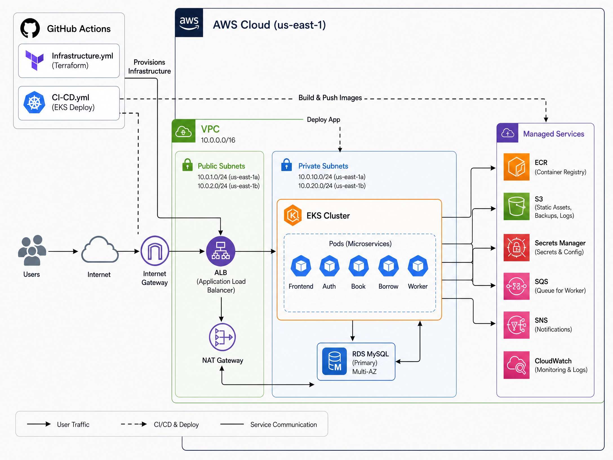

# Digital Library — Cloud Native Application on AWS EKS

A production-grade, three-tier digital library application deployed on AWS EKS using Terraform, Kubernetes, and GitHub Actions.



---

## Tech Stack

| Layer | Technology |
|---|---|
| Infrastructure | Terraform, AWS (EKS, RDS, S3, SQS, SNS, ECR, CloudWatch) |
| Container Orchestration | Kubernetes (EKS 1.31) |
| Backend | Python Flask (microservices) |
| Frontend | React + Vite, served via Nginx |
| CI/CD | GitHub Actions |
| Secrets | AWS Secrets Manager + SSM Parameter Store via IRSA |

---

## Architecture

```
Internet → ALB → EKS (private subnets)
                  ├── auth-service     :5001
                  ├── book-service     :5002
                  ├── borrow-service   :5003
                  ├── frontend         :80
                  └── worker (SQS consumer)
                           ↓
                    RDS MySQL (private)
                    SQS → SNS → Email alerts
```

**Services**
- `auth` — user signup and login
- `book` — book catalogue, add books, bulk CSV import via SQS
- `borrow` — borrow records, triggers async email via SQS
- `worker` — polls SQS, sends SNS emails for borrow confirmations and new books
- `frontend` — React SPA, Nginx proxies API calls to backend services

---

## Infrastructure

All infrastructure is managed by Terraform with remote state in S3.

| Resource | Purpose |
|---|---|
| VPC | 2 public + 2 private subnets across 2 AZs, NAT Gateway |
| EKS | Kubernetes 1.31 cluster, t3.small nodes, custom launch template |
| RDS | MySQL 8.0, private subnet, AWS-managed password rotation |
| ECR | 5 private repos — auth, book, borrow, frontend, worker |
| S3 | Assets bucket with versioning and encryption |
| SQS | Orders queue + DLQ, redrive policy after 5 failures |
| SNS | Alerts topic, multiple email subscriptions |
| Secrets Manager | RDS master password, JWT signing key |
| SSM | Non-sensitive config (DB host, queue URL, SNS ARN, etc.) |
| CloudWatch | Log groups per service, 4 alarms, dashboard |
| IAM / IRSA | Least-privilege roles per workload, no static keys in pods |

---

## Prerequisites

- Terraform >= 1.10
- AWS CLI configured
- kubectl
- Helm 3
- Docker

---

## Provisioning Infrastructure

```bash
cd terraform

# Init and apply
terraform init
terraform apply

# Install ALB Controller after apply
helm repo add eks https://aws.github.io/eks-charts && helm repo update
VPC_ID=$(terraform output -raw vpc_id)
ALB_ROLE=$(terraform output -raw alb_controller_role_arn)

helm upgrade --install aws-load-balancer-controller eks/aws-load-balancer-controller \
  -n kube-system \
  --set clusterName=digital-library-prod-eks \
  --set region=us-east-1 \
  --set vpcId=$VPC_ID \
  --set "serviceAccount.annotations.eks\.amazonaws\.com/role-arn=$ALB_ROLE"
```

---

## Deploying the Application

**1. Configure kubectl**
```bash
aws eks update-kubeconfig --name digital-library-prod-eks --region us-east-1
```

**2. Build and push images**
```bash
aws ecr get-login-password --region us-east-1 | \
  docker login --username AWS --password-stdin 393323650493.dkr.ecr.us-east-1.amazonaws.com

# Repeat for each service: auth, book, borrow, frontend, worker
docker build -t digital-library-auth ./app/auth
docker tag digital-library-auth:latest 393323650493.dkr.ecr.us-east-1.amazonaws.com/digital-library-auth:latest
docker push 393323650493.dkr.ecr.us-east-1.amazonaws.com/digital-library-auth:latest
```

**3. Apply manifests**
```bash
kubectl apply -f k8s/namespace.yaml
kubectl apply -f k8s/serviceaccount.yaml
kubectl apply -f k8s/configmap.yaml
kubectl apply -f k8s/auth-deployment.yaml
kubectl apply -f k8s/book-deployment.yaml
kubectl apply -f k8s/borrow-deployment.yaml
kubectl apply -f k8s/frontend-deployment.yaml
kubectl apply -f k8s/worker-deployment.yaml
kubectl apply -f k8s/ingress.yaml
kubectl apply -f k8s/hpa.yaml
kubectl apply -f k8s/cloudwatch-daemonset-observability.yaml
```

**4. Run DB schema**
```bash
kubectl run mysql-client --image=mysql:8.0 --restart=Never -n library -- sleep 3600
kubectl exec -it mysql-client -n library -- mysql \
  -h <rds-endpoint> -u admin -p digitallibrary < app/database/schema.sql
kubectl delete pod mysql-client -n library
```

**5. Get the ALB DNS**
```bash
kubectl get ingress library-ingress -n library
```

---

## CI/CD Pipelines

Two GitHub Actions workflows handle everything automatically.

### infrastructure.yml

Triggers on changes to `*.tf` files.

- **PR** → runs `terraform plan`, posts output as PR comment
- **Push to main** → runs `terraform apply`, installs ALB Controller via Helm

Requires: `AWS_ACCESS_KEY_ID`, `AWS_SECRET_ACCESS_KEY` in GitHub Secrets.

### ci-cd.yml

Triggers on changes to `app/**` or `k8s/**`.

- Builds all 5 Docker images in parallel
- Runs Trivy security scan on each image
- Deploys to EKS, waits for rollout
- Smoke tests all health endpoints
- Sends SNS notification on success or failure

Requires: `AWS_ACCESS_KEY_ID`, `AWS_SECRET_ACCESS_KEY` in GitHub Secrets.

---

## Secrets and Config

No secrets are stored in the Docker images or Kubernetes manifests.

- **DB password** → fetched from Secrets Manager at pod startup via IRSA
- **All other config** → fetched from SSM Parameter Store at pod startup
- **IRSA** — each pod role is scoped to exactly the AWS resources it needs

Local development falls back to environment variables (`docker-compose.yml`).

---

## Local Development

```bash
cd app
docker compose up --build
```

| Service | URL |
|---|---|
| Frontend | http://localhost:3000 |
| Auth | http://localhost:5001 |
| Book | http://localhost:5002 |
| Borrow | http://localhost:5003 |

---

## Bulk Book Import via SQS

Upload a CSV to populate the book catalogue. Each row is queued as a separate SQS message and processed by the worker.

```bash
curl -X POST http://<ALB_DNS>/books/import \
  -F "file=@app/database/devops_books.csv"
```

CSV format:
```
title,author
The Phoenix Project,Gene Kim
Kubernetes in Action,Marko Luksa
```

---

## Monitoring

**CloudWatch Dashboard** — `digital-library-prod`

- EKS node CPU
- RDS CPU and free storage
- SQS queue depth and DLQ depth
- All 4 alarm statuses

**Alarms** (notify via SNS email):

| Alarm | Threshold |
|---|---|
| EKS node CPU | > 80% for 10 min |
| RDS CPU | > 80% for 10 min |
| RDS free storage | < 5 GB |
| SQS DLQ depth | > 0 messages |

**Logs** — Fluent Bit ships all container logs to CloudWatch:
- `/digital-library/prod/application`
- `/digital-library/prod/worker`

---

## Repository Structure

```
├── app/
│   ├── auth/          Flask auth service
│   ├── book/          Flask book service
│   ├── borrow/        Flask borrow service
│   ├── frontend/      React + Nginx
│   ├── worker/        SQS consumer
│   └── database/      Schema SQL + seed CSV
├── k8s/               Kubernetes manifests
├── modules/
│   ├── vpc/           VPC, subnets, NAT, security groups
│   ├── eks/           EKS cluster, node group, launch template
│   ├── iam/           EKS cluster and node IAM roles
│   ├── iam-irsa/      App pod and CloudWatch agent IRSA roles
│   ├── alb-controller ALB Controller IRSA role and policy
│   ├── rds/           RDS MySQL instance
│   ├── ecr/           ECR repositories
│   ├── s3/            Assets S3 bucket
│   ├── sqs/           Orders queue and DLQ
│   ├── sns/           Alerts topic and subscriptions
│   ├── secrets/       JWT signing key in Secrets Manager
│   ├── ssm/           Config parameters
│   └── cloudwatch/    Log groups, alarms, dashboard
├── .github/workflows/
│   ├── infrastructure.yml
│   └── ci-cd.yml
├── backend.tf
├── main.tf
├── outputs.tf
├── provider.tf
└── variables.tf
```

---

## Security

- All pods use IRSA — no static AWS credentials anywhere
- RDS in private subnets — no public access
- Secrets Manager handles DB password rotation automatically
- IMDSv2 enforced on all EKS nodes
- ECR images scanned by Trivy on every build
- SQS DLQ isolates failed messages for investigation

---

## Author

**Syam Joshi Kalaga**
